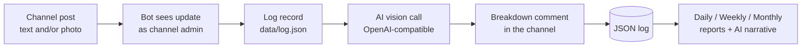

# tg_wl_bot — AI food-diary Telegram bot

A personal Telegram bot (teloxide + Rust) for a **food-log channel**:

- You post what you eat in your channel (text and/or a photo).
- The bot comments each post with an **AI breakdown**: items detected, portion notes, per-item and total calorie estimates, macros and a confidence level.
- It tracks your **logging performance** (posts, analyzed/failed, days logged vs missed, streaks, avg/day vs a target) and sends **daily / weekly / monthly reports** with an AI-written narrative.
- Old posts can be imported by **forwarding** them to the bot in DM (bots cannot read channel history).

Everything is stored in a plain JSON file (`data/log.json`) — easy to back up and inspect.

## Setup

1. Create a bot with [@BotFather](https://t.me/BotFather) and copy the token.
2. Create your private food-log channel (if you don't have one) and **add the bot as an admin** with the _Post messages_ permission — that lets it see posts and comment breakdowns.
3. Configure environment (see `.env.example`; the bot also loads a `.env` file from the working dir):

```bash
cp .env.example .env
$EDITOR .env
```

4. Run:

```bash
cargo run --release
```

5. Open a private chat with your bot and send `/start` — you become the owner and get the usage help.

## How it works



- **New posts** (channel): analyzed within seconds; the breakdown is **appended to your post itself** — the bot edits the post and adds the analysis after a `----` seam (it keeps your original text intact in its log). If Telegram refuses the edit (bot lacks the _Edit messages_ right, the post is too old, or the caption would exceed 1024 chars), it falls back to posting a separate comment.
- **Edited posts**: when you edit your post, the bot strips its previously appended section (detected via the `----` seam), re-analyzes the changed text and rewrites the appended breakdown. The seam also makes forwarded copies of analyzed posts safe: the bot strips its own section before logging.
- **Albums**: a media group is buffered briefly and analyzed as **one meal** with a single AI call over all its photos.
- **Quick logging**: send a photo/text directly to the bot in DM — analyzed and counted in reports.
- **Backfilling history**: Telegram bots can't read chat history. Forward old posts to the bot in DM **or into the channel**; it logs them under their **original date** and **skips duplicates** (identity = original channel + message id), so double-forwarding is safe. It also appends the breakdown to the original post. Editing an old post also (re)logs it.
- **Commands in the channel**: posting `/today`, `/report …`, `/rescan` … directly in the channel runs the command there — the bot answers as a channel post. Commands are never logged as meals.

## Commands (in DM or in the channel)

| Command                         | Meaning                              |
| ------------------------------- | ------------------------------------ |
| `/start`, `/help`               | usage help                           |
| `/today`                        | today's log so far                   |
| `/report day\|week\|month`      | current period so far                |
| `/report day\|week\|month last` | the previous, completed period       |
| `/rescan`                       | instructions for importing old posts |
| `/status`                       | record counts, model, schedule       |

Reports include: posts logged, analyzed/failed counts, total calories with estimated range, avg/day vs `CALORIE_TARGET`, macro estimates, per-day/per-post timelines, missed days, streak, most-logged foods, and an optional AI commentary paragraph.

## Configuration

| Variable                | Default                     | Meaning                                                                                           |
| ----------------------- | --------------------------- | ------------------------------------------------------------------------------------------------- |
| `TELOXIDE_TOKEN`        | — (required)                | bot token from @BotFather                                                                         |
| `AI_API_KEY`            | —                           | key for the AI provider (empty for local servers)                                                 |
| `AI_BASE_URL`           | `https://api.openai.com/v1` | any OpenAI-compatible endpoint                                                                    |
| `AI_MODEL`              | `gpt-4o-mini`               | vision-capable model                                                                              |
| `TRACKED_CHAT_ID`       | —                           | restrict tracking to this chat id                                                                 |
| `OWNER_ID`              | —                           | owner user id (else first `/start` wins)                                                          |
| `REPORT_CHAT_ID`        | —                           | target chat for scheduled reports                                                                 |
| `TZ_OFFSET_MINUTES`     | `0`                         | your UTC offset (e.g. `180` = UTC+3)                                                              |
| `DAILY_REPORT_TIME`     | `00:05`                     | daily report time (local, HH:MM)                                                                  |
| `WEEKLY_REPORT_TIME`    | `00:05`                     | weekly report time, sent Mondays                                                                  |
| `MONTHLY_REPORT_TIME`   | `00:10`                     | monthly report time, sent on the 1st                                                              |
| `CALORIE_TARGET`        | —                           | daily kcal target for reports                                                                     |
| `AI_COMMENT_IN_CHANNEL` | `true`                      | touch the channel at all (breakdown as edit or comment)                                           |
| `AI_EDIT_POSTS`         | `true`                      | append the breakdown to the post itself (edit-in-place); `false` = always post a separate comment |
| `AI_LANGUAGE`           | —                           | force a language for AI output (e.g. `fa`); unset = follow each post's language, English fallback |
| `AI_NARRATIVE`          | `true`                      | AI commentary in scheduled reports                                                                |
| `DATA_DIR`              | `data`                      | storage directory                                                                                 |

Works with any OpenAI-compatible provider, e.g.:

- OpenAI: `AI_BASE_URL=https://api.openai.com/v1`, `AI_MODEL=gpt-4o-mini`
- OpenRouter: `AI_BASE_URL=https://openrouter.ai/api/v1`
- Gemini: `AI_BASE_URL=https://generativelanguage.googleapis.com/v1beta/openai`
- Ollama (local): `AI_BASE_URL=http://localhost:11434/v1`, `AI_MODEL=llava` (needs a vision model), no API key
- Opencode: if `AI_BASE_URL` contains `opencode.ai`, the bot automatically sends a stable `x-opencode-session` id (generated once and persisted in `data/log.json`) and a self-identifying `User-Agent` (`tg_wl_bot/<version>`), as required by their API. It also always sends that User-Agent to every provider.

## Storage

- `data/log.json` — the whole log (records keyed by `{chat_id}:{message_id}`, plus report markers and the owner chat).
- `data/media/*.jpg` — downloaded photo cache (used for AI calls; safe to delete).

Atomic writes (temp file + rename), so corruption on crash is unlikely. Delete `log.json` to start fresh.

## Limitations

- Bots receive queued updates for only ~24 h while offline — posts sent to the channel during a longer outage won't be seen unless forwarded to the bot (that's the backfill flow).
- AI calorie estimates are ballparks (±20% is normal); the confidence field reflects how much the model had to guess.
- Scheduled reports are sent to the first configured target chat; if none is configured yet, they're skipped until the owner `/start`s the bot.
